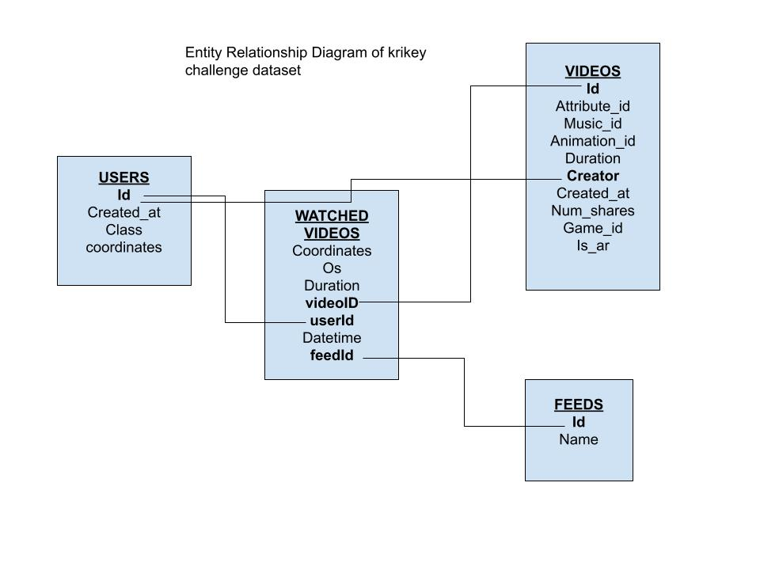

# Krikey Senior Data Analyst Take Home Assignment
This repository has been created as a part of krikey's take home assingment. As per the suggestion by krikey team, my complete solution is consolidated and presented in 3 parts. The following table summarizes different parts/sections of this challenge.   

# Table of Contents
1. [Exploratory Data Analysis](#exploratory-data-analysis)
2. [Two Page Write Up](#two-page-write-up)
3. [Krikey App Data Projects](#krikey-app-data-projects)
4. [List of Tech Stack](#list-of-tech-stack)

# Exploratory Data Analysis
First part of the challenge requires exploratory data analysis on the dataset provided. In this section, I first document my notes on different data sources that are provided under the sub-section [Data sources provided](#data-sources-provided). This is followed by a sub-section that details about the jupter notebook used for [exploratory data analysis](#link-to-eda-notebook) and the final sub-section [lists important outcomes from the analysis](#important-outcomes-from-the-analysis).

## Data sources 
The dataset contains following tables:
1. **watchedVideo**: This contains all occurrences of the watchedVideo event.
2. **users**: This table contains the registered users
3. **videos**: This table contains all created videos
4. **feeds**: This contains the feeds the videos are served on

Entity Relationship Diagram of the Krikey challenge dataset is shown below:

## Link to EDA notebook
Jupyter Notebook that includes exploratory data analysis can be found [here](1_exploratory_data_analysis_krikey.ipynb)

## Important Outcomes from the Analysis
In this section, we display selected outcomes from the exploratory data analysis that is completed in the previous section. This sub-section will serve like a middle-round to organize the data analysis results and get your thoughts organized before the write-up.  

# Two Page Write up
Second part of the challenge requires a 2 page write up to present results to the executive team. This write up is submitted as a google document file and can be accessed from [here]().

- Product recommendations section
- Analysis details - findings, methodology, limitations, charts, source code
- Next steps - outstanding questions or interesting ideas you think the team should explore

# Krikey App Data Projects
In the final part of the challenge, I downloaded and explored the krikey app to provide a list of 3 analytics reports that would contribute to the app's overall growth and retention. Identified (3) reports are submitted in a one page document that can be accessed from [here]()

# List of Tech Stack
The tech stack that I used for this challenge are:
1. **Docker** 
2. **Jupyter Notebook** 

Use of above tech stack will assure work's:
- Reproducibility
- Local experiments
- Integration Test (CI/CD)
- Running data pipelines on the cloud (AWS Batch, Kubernetes jobs)
